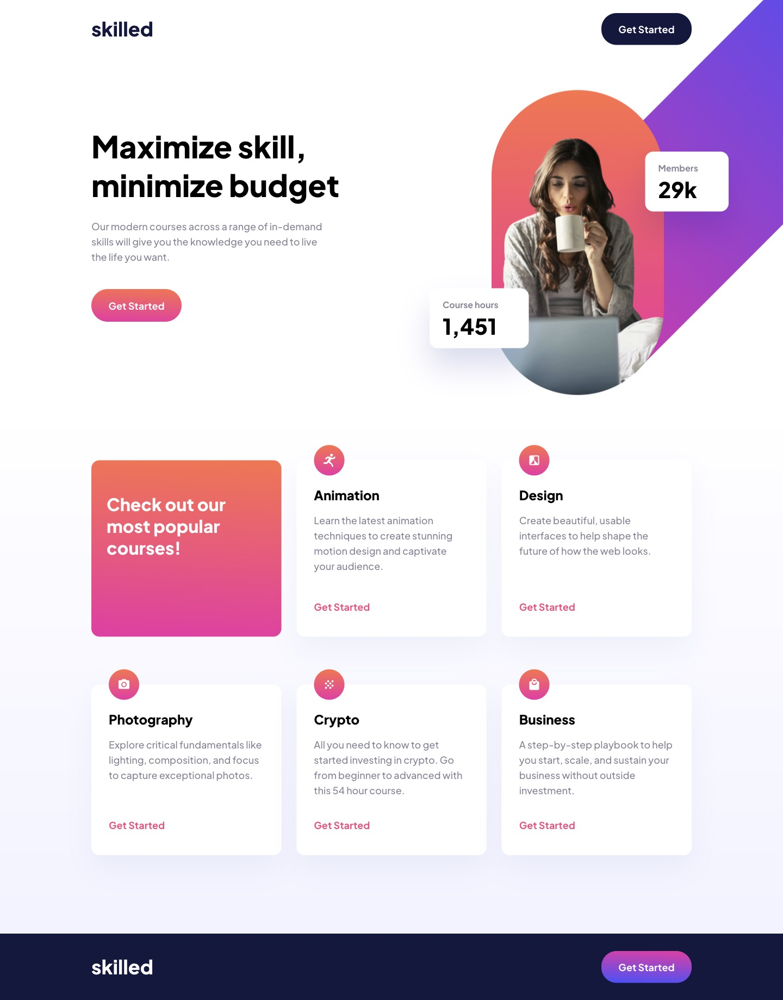
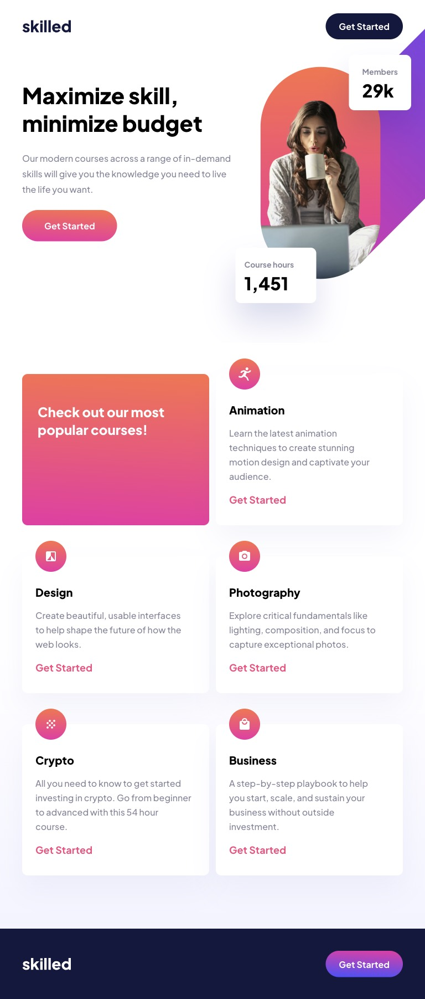
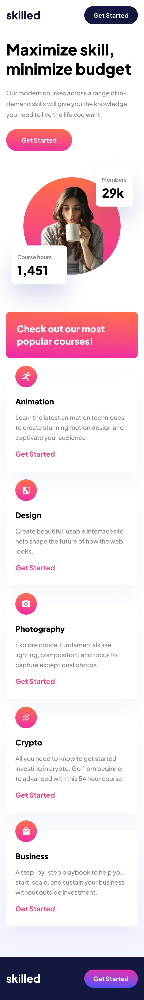

# Frontend Mentor - Skilled e-learning landing page solution

This is Max Ruuen's solution to the [Skilled e-learning landing page challenge on Frontend Mentor](https://www.frontendmentor.io/challenges/skilled-elearning-landing-page-S1ObDrZ8q). Frontend Mentor challenges help you improve your coding skills by building realistic projects.

## Table of contents

- [Overview](#overview)
  - [The challenge](#the-challenge)
  - [Screenshot](#screenshot)
  - [Links](#links)
- [What I learned](#what-i-learned)
- [Author](#author)

## Overview

### The challenge

Users should be able to:

- View the optimal layout depending on their device's screen size
- See hover states for interactive elements

### Screenshot

#### Desktop Solution

#### Tablet Solution

#### Mobile Solution

### Links

<!-- - Solution URL: [Add solution URL here](https://your-solution-url.com)
- Live Site URL: [Add live site URL here](https://your-live-site-url.com) -->

## What I learned

This challenge was completed almost a year ago, so I am quite happy with the work after taking a break to work on backend learning.

The asset provided for the mobile hero image had extra whitespace at the bottom and clipping of the box shadows which did not look great. The tablet image also had a similar problem with the skewed rectangle being larger than required which made styling it in a responsive manner hard without small hacks.

As a result I decided to re-export the assets from Figma & build the text elements with CSS, and I think this turned out really well.

## Author

- Frontend Mentor - [@ruuendigital](https://www.frontendmentor.io/profile/ruuendigital)
- Twitter - [@maxruuen](https://www.twitter.com/maxruuen)
